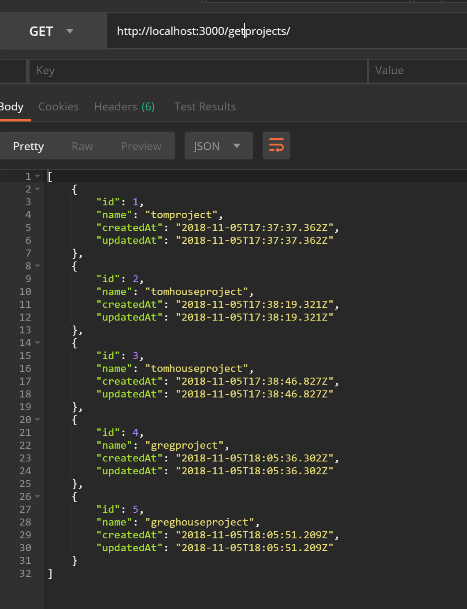

# Testing out associations n:m

Here is an exaple of the data in the DB. There are 3 tables:
- Users
- Projects
- UserProjects

## Users `belongsToMany` Projects `through` UserProjects

## When a user creates a project they see this: 

## When a user retrieves their own projects they see this:

## When the full list of projects is retrieved: 

